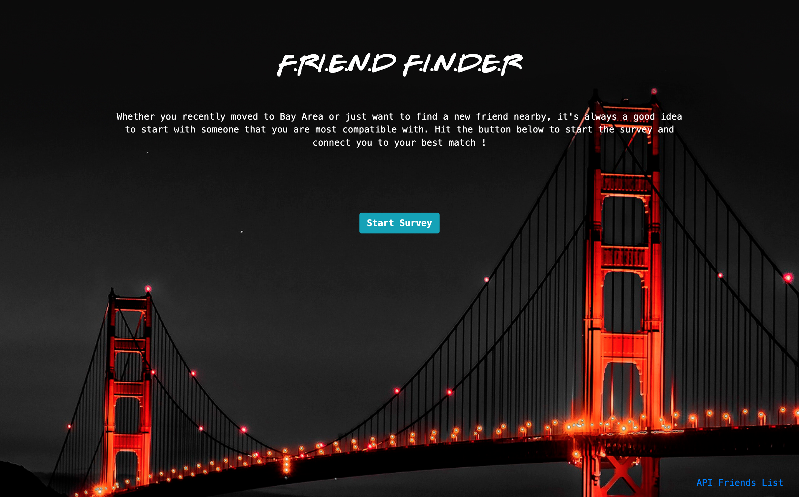

# Friend Finder

> Friend Finder is an app built with `Node.js` and `Express` that lets user connect to a new friend based on compatibility.

<!-- toc -->

- [Friend Finder](#friend-finder)
  - [Overview](#overview)
  - [Live Demo](#live-demo)
  - [Project Screenshots](#project-screenshots)
    - [Homepage](#homepage)
    - [Survey Page](#survey-page)
  - [Technologies](#technologies)
  - [Instructions](#instructions)

<!-- tocstop -->

-----

## Overview

**Friend Finder** lets users take a survey of 10 questions, then compare their answers with other people to find the closest match.  `Node.js` and `Express` were used in the *server-side* to handle routing and `AJAX` requests from the *client-side*. 
App data including *users' names*, *picture links*, *survey questions* and *results* are stored in `MySQL`.  The app is hosted on `Heroku` and connects to `MySQL` server using `JawsDB` add-on. 

-----

## Live Demo

**Friend Finder** is deployed to Heroku. Check it out [here.](https://finding-friend.herokuapp.com/)

-----

## Project Screenshots

### Homepage 

- Click on the button **Start Survey** will take users to the survey page. 
- Click on the **API Friends List** link at the bottom right corner will display all friends (JSON format) in the database.

### Survey Page

- After finsihing the survey, the app will show users their best match using `Bootstrap` modal. 
- Users will be redirect to homepage after they close the result modal.

-----

## Technologies

- Node.js
- Express
- AJAX
- JQuery
- Bootstrap 4
- MySQL

-----

## Instructions

1. Your survey should have 10 questions of your choosing. Each answer should be on a scale of 1 to 5 based on how much the user agrees or disagrees with a question.

2. Your `server.js` file should require the basic npm packages we've used in class: `express`, `path`, `mysql`.

3. Your public folder should include two files - it should also be static in your server.js file: 

   * A GET Route to `survey.html` which should display the survey page. This page should show a form input with:
     * user's name - this will go into the friend table as the *friend_name*.
     * user's picture link - this will go into the friends table as *picture_link*.
     * all of the questions and a dropdown or radio buttons of 1 to 5. The results of this will go into the scores table.

    * Your home page `home.html` should link to survey.html and display all the friends in the database.

4. Your `server.js` file should contain two routes:

   * A GET route with the url `/api/friends`. This will be used to display all friends from the friends table in json.

   * A POST routes `/api/friends`. This will be used to handle incoming survey results. This route will also be used to handle the compatibility logic.

5. You should save your application's data inside of `app/db/schema.sql` and `seeds.sql`

   - In the **schema.sql** file:
  
     - your questions table should have all of the questions: *id, question*.
     - your friends table should have a name and photo column: *id, name, picture_link*.
     - your scores table should have *id, question_id, friend_id, score*.

   - In the **seeds.sql** file:
     - write some inserts into the questions table.

6. Determine the user's most compatible friend using the following as a guide:
   - Compare the differences between the person's score and other people's scores, the smallest differences are possible friendships. Remember to take the *absolute value*.

7. Once you've found the current user's most compatible friend, display the result(s) on the page.
   - It should show the name of the friend and the picture.

